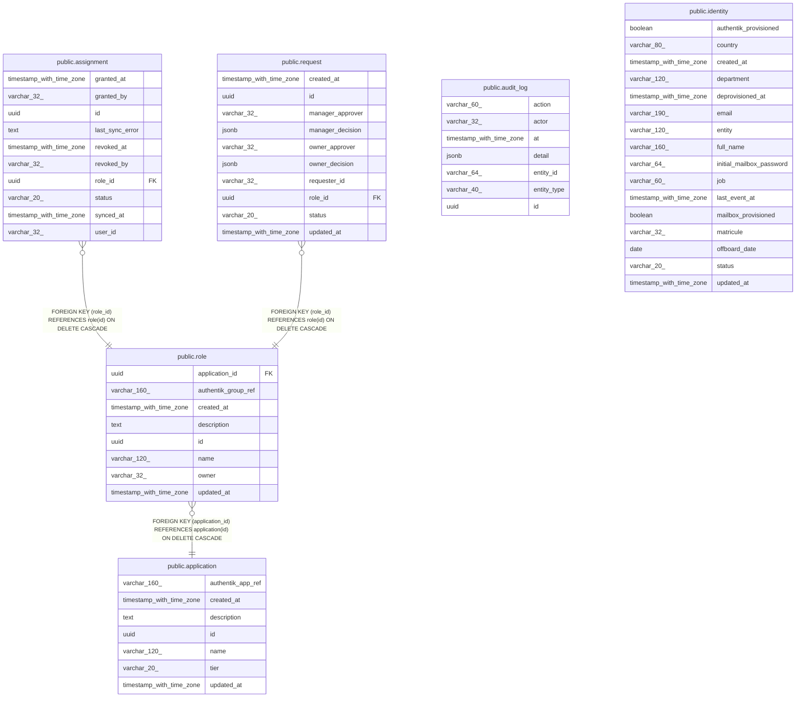

# ktayl_iam

## Tables

| Name                                        | Columns | Comment | Type       |
| ------------------------------------------- | ------- | ------- | ---------- |
| [public.application](public.application.md) | 7       |         | BASE TABLE |
| [public.assignment](public.assignment.md)   | 10      |         | BASE TABLE |
| [public.audit_log](public.audit_log.md)     | 7       |         | BASE TABLE |
| [public.identity](public.identity.md)       | 16      |         | BASE TABLE |
| [public.request](public.request.md)         | 10      |         | BASE TABLE |
| [public.role](public.role.md)               | 8       |         | BASE TABLE |

## Relations

---

> Generated by [tbls](https://github.com/k1LoW/tbls)
