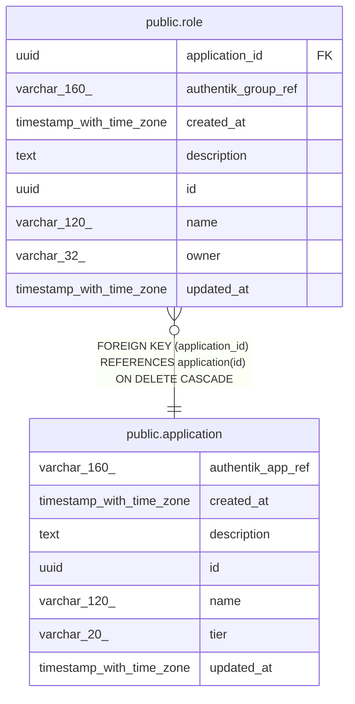

# public.application

## Columns

| Name              | Type                     | Default           | Nullable | Children                      | Parents | Comment |
| ----------------- | ------------------------ | ----------------- | -------- | ----------------------------- | ------- | ------- |
| authentik_app_ref | varchar(160)             |                   | false    |                               |         |         |
| created_at        | timestamp with time zone | now()             | false    |                               |         |         |
| description       | text                     |                   | true     |                               |         |         |
| id                | uuid                     | gen_random_uuid() | false    | [public.role](public.role.md) |         |         |
| name              | varchar(120)             |                   | false    |                               |         |         |
| tier              | varchar(20)              |                   | false    |                               |         |         |
| updated_at        | timestamp with time zone | now()             | false    |                               |         |         |

## Constraints

| Name                | Type        | Definition       |
| ------------------- | ----------- | ---------------- |
| application_pkey    | PRIMARY KEY | PRIMARY KEY (id) |
| uq_application_name | UNIQUE      | UNIQUE (name)    |

## Indexes

| Name                | Definition                                                                       |
| ------------------- | -------------------------------------------------------------------------------- |
| application_pkey    | CREATE UNIQUE INDEX application_pkey ON public.application USING btree (id)      |
| uq_application_name | CREATE UNIQUE INDEX uq_application_name ON public.application USING btree (name) |

## Relations

---

> Generated by [tbls](https://github.com/k1LoW/tbls)
