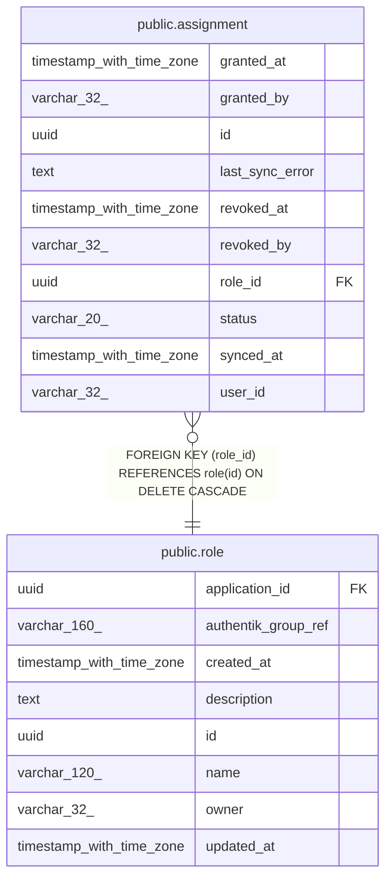

# public.assignment

## Columns

| Name            | Type                     | Default                     | Nullable | Children | Parents                       | Comment |
| --------------- | ------------------------ | --------------------------- | -------- | -------- | ----------------------------- | ------- |
| granted_at      | timestamp with time zone | now()                       | false    |          |                               |         |
| granted_by      | varchar(32)              |                             | true     |          |                               |         |
| id              | uuid                     | gen_random_uuid()           | false    |          |                               |         |
| last_sync_error | text                     |                             | true     |          |                               |         |
| revoked_at      | timestamp with time zone |                             | true     |          |                               |         |
| revoked_by      | varchar(32)              |                             | true     |          |                               |         |
| role_id         | uuid                     |                             | false    |          | [public.role](public.role.md) |         |
| status          | varchar(20)              | 'active'::character varying | false    |          |                               |         |
| synced_at       | timestamp with time zone |                             | true     |          |                               |         |
| user_id         | varchar(32)              |                             | false    |          |                               |         |

## Constraints

| Name                    | Type        | Definition                                                  |
| ----------------------- | ----------- | ----------------------------------------------------------- |
| assignment_pkey         | PRIMARY KEY | PRIMARY KEY (id)                                            |
| assignment_role_id_fkey | FOREIGN KEY | FOREIGN KEY (role_id) REFERENCES role(id) ON DELETE CASCADE |

## Indexes

| Name            | Definition                                                                |
| --------------- | ------------------------------------------------------------------------- |
| assignment_pkey | CREATE UNIQUE INDEX assignment_pkey ON public.assignment USING btree (id) |

## Relations

---

> Generated by [tbls](https://github.com/k1LoW/tbls)
