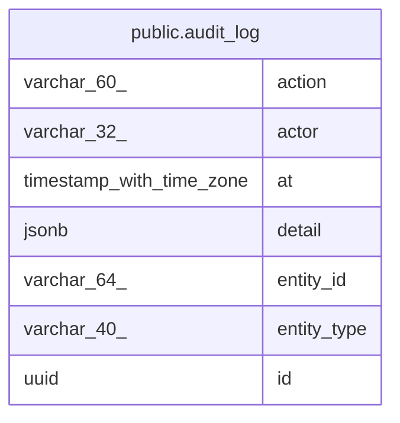

# public.audit_log

## Columns

| Name        | Type                     | Default           | Nullable | Children | Parents | Comment |
| ----------- | ------------------------ | ----------------- | -------- | -------- | ------- | ------- |
| action      | varchar(60)              |                   | false    |          |         |         |
| actor       | varchar(32)              |                   | false    |          |         |         |
| at          | timestamp with time zone | now()             | false    |          |         |         |
| detail      | jsonb                    | '{}'::jsonb       | false    |          |         |         |
| entity_id   | varchar(64)              |                   | false    |          |         |         |
| entity_type | varchar(40)              |                   | false    |          |         |         |
| id          | uuid                     | gen_random_uuid() | false    |          |         |         |

## Constraints

| Name           | Type        | Definition       |
| -------------- | ----------- | ---------------- |
| audit_log_pkey | PRIMARY KEY | PRIMARY KEY (id) |

## Indexes

| Name            | Definition                                                                            |
| --------------- | ------------------------------------------------------------------------------------- |
| audit_log_pkey  | CREATE UNIQUE INDEX audit_log_pkey ON public.audit_log USING btree (id)               |
| ix_audit_entity | CREATE INDEX ix_audit_entity ON public.audit_log USING btree (entity_type, entity_id) |

## Relations

---

> Generated by [tbls](https://github.com/k1LoW/tbls)
