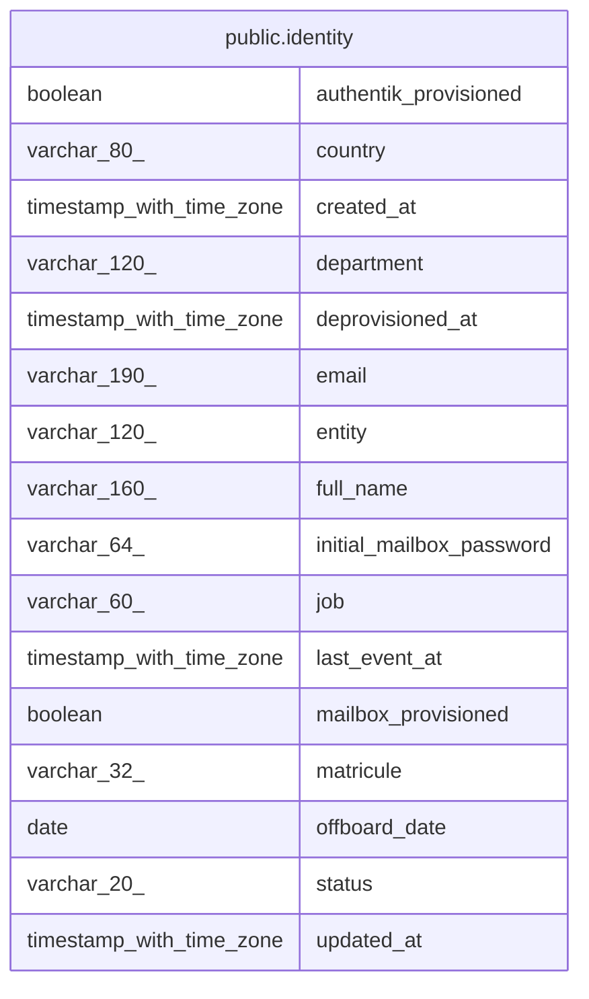

# public.identity

## Columns

| Name                     | Type                     | Default                     | Nullable | Children | Parents | Comment |
| ------------------------ | ------------------------ | --------------------------- | -------- | -------- | ------- | ------- |
| authentik_provisioned    | boolean                  | false                       | false    |          |         |         |
| country                  | varchar(80)              |                             | true     |          |         |         |
| created_at               | timestamp with time zone | now()                       | false    |          |         |         |
| department               | varchar(120)             |                             | true     |          |         |         |
| deprovisioned_at         | timestamp with time zone |                             | true     |          |         |         |
| email                    | varchar(190)             |                             | true     |          |         |         |
| entity                   | varchar(120)             |                             | true     |          |         |         |
| full_name                | varchar(160)             |                             | false    |          |         |         |
| initial_mailbox_password | varchar(64)              |                             | true     |          |         |         |
| job                      | varchar(60)              |                             | true     |          |         |         |
| last_event_at            | timestamp with time zone |                             | true     |          |         |         |
| mailbox_provisioned      | boolean                  | false                       | false    |          |         |         |
| matricule                | varchar(32)              |                             | false    |          |         |         |
| offboard_date            | date                     |                             | true     |          |         |         |
| status                   | varchar(20)              | 'active'::character varying | false    |          |         |         |
| updated_at               | timestamp with time zone | now()                       | false    |          |         |         |

## Constraints

| Name          | Type        | Definition              |
| ------------- | ----------- | ----------------------- |
| identity_pkey | PRIMARY KEY | PRIMARY KEY (matricule) |

## Indexes

| Name              | Definition                                                                   |
| ----------------- | ---------------------------------------------------------------------------- |
| identity_pkey     | CREATE UNIQUE INDEX identity_pkey ON public.identity USING btree (matricule) |
| uq_identity_email | CREATE UNIQUE INDEX uq_identity_email ON public.identity USING btree (email) |

## Relations

---

> Generated by [tbls](https://github.com/k1LoW/tbls)
