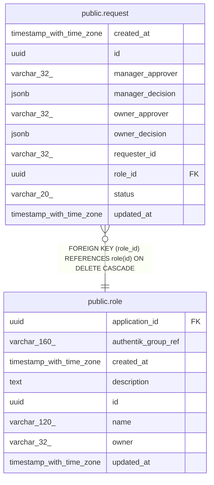

# public.request

## Columns

| Name             | Type                     | Default                      | Nullable | Children | Parents                       | Comment |
| ---------------- | ------------------------ | ---------------------------- | -------- | -------- | ----------------------------- | ------- |
| created_at       | timestamp with time zone | now()                        | false    |          |                               |         |
| id               | uuid                     | gen_random_uuid()            | false    |          |                               |         |
| manager_approver | varchar(32)              |                              | true     |          |                               |         |
| manager_decision | jsonb                    |                              | true     |          |                               |         |
| owner_approver   | varchar(32)              |                              | true     |          |                               |         |
| owner_decision   | jsonb                    |                              | true     |          |                               |         |
| requester_id     | varchar(32)              |                              | false    |          |                               |         |
| role_id          | uuid                     |                              | false    |          | [public.role](public.role.md) |         |
| status           | varchar(20)              | 'pending'::character varying | false    |          |                               |         |
| updated_at       | timestamp with time zone | now()                        | false    |          |                               |         |

## Constraints

| Name                 | Type        | Definition                                                  |
| -------------------- | ----------- | ----------------------------------------------------------- |
| request_pkey         | PRIMARY KEY | PRIMARY KEY (id)                                            |
| request_role_id_fkey | FOREIGN KEY | FOREIGN KEY (role_id) REFERENCES role(id) ON DELETE CASCADE |

## Indexes

| Name         | Definition                                                          |
| ------------ | ------------------------------------------------------------------- |
| request_pkey | CREATE UNIQUE INDEX request_pkey ON public.request USING btree (id) |

## Relations

---

> Generated by [tbls](https://github.com/k1LoW/tbls)
