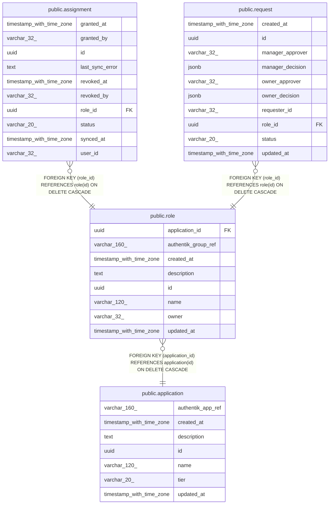

# public.role

## Columns

| Name                | Type                     | Default           | Nullable | Children                                                                      | Parents                                     | Comment |
| ------------------- | ------------------------ | ----------------- | -------- | ----------------------------------------------------------------------------- | ------------------------------------------- | ------- |
| application_id      | uuid                     |                   | false    |                                                                               | [public.application](public.application.md) |         |
| authentik_group_ref | varchar(160)             |                   | false    |                                                                               |                                             |         |
| created_at          | timestamp with time zone | now()             | false    |                                                                               |                                             |         |
| description         | text                     |                   | true     |                                                                               |                                             |         |
| id                  | uuid                     | gen_random_uuid() | false    | [public.assignment](public.assignment.md) [public.request](public.request.md) |                                             |         |
| name                | varchar(120)             |                   | false    |                                                                               |                                             |         |
| owner               | varchar(32)              |                   | false    |                                                                               |                                             |         |
| updated_at          | timestamp with time zone | now()             | false    |                                                                               |                                             |         |

## Constraints

| Name                     | Type        | Definition                                                                |
| ------------------------ | ----------- | ------------------------------------------------------------------------- |
| role_application_id_fkey | FOREIGN KEY | FOREIGN KEY (application_id) REFERENCES application(id) ON DELETE CASCADE |
| role_pkey                | PRIMARY KEY | PRIMARY KEY (id)                                                          |
| uq_role_app_name         | UNIQUE      | UNIQUE (application_id, name)                                             |

## Indexes

| Name             | Definition                                                                             |
| ---------------- | -------------------------------------------------------------------------------------- |
| role_pkey        | CREATE UNIQUE INDEX role_pkey ON public.role USING btree (id)                          |
| uq_role_app_name | CREATE UNIQUE INDEX uq_role_app_name ON public.role USING btree (application_id, name) |

## Relations

---

> Generated by [tbls](https://github.com/k1LoW/tbls)
